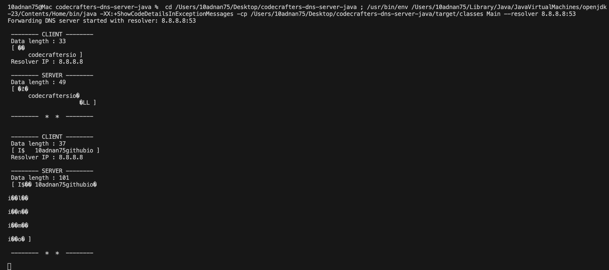
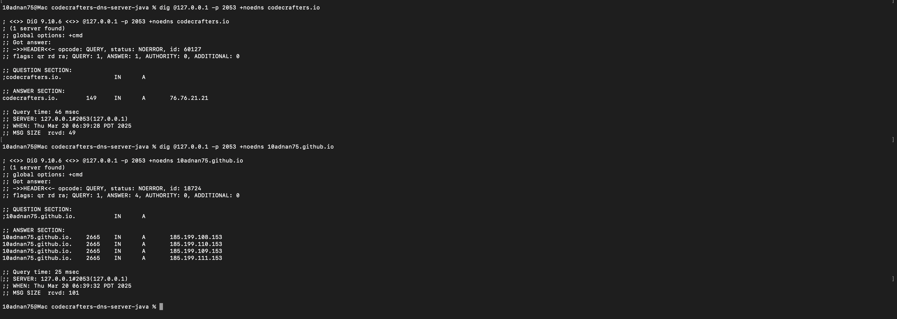

[](https://app.codecrafters.io/users/codecrafters-bot?r=2qF)

This is a starting point for Java solutions to the
["Build Your Own DNS server" Challenge](https://app.codecrafters.io/courses/dns-server/overview).

I built a DNS server that's capable of parsing and
creating DNS packets, responding to DNS queries, handling various record types
and doing recursive resolve. Along the way I learnt about the DNS protocol,
DNS packet format, root servers, authoritative servers, forwarding servers,
various record types (A, AAAA, CNAME, etc) and more.

**Note**: If you're viewing this repo on GitHub, head over to
[codecrafters.io](https://codecrafters.io) to try the challenge.

# Download the source code

Run the below command on your terminal to clone the repository locally on your machine.

```sh
git clone https://github.com/10adnan75/dns-server.git
```

# Fork or create your own repository on Github

Run the below commmands on your terminal to initialize a repository.

```sh
git init
git remote add origin <your-repository-url>
git add .
git commit -am "your-commit-message" # any msg
git push origin master
```

# Run locally on your machine

The entry point for your `your_program.sh` implementation is in
`src/main/java/Main.java`.

Server: Open a terminal, and compile and run your java code using the below commands:

```sh
cd /dns-server
/target/classes Main --resolver <address>
```

Client: Open another terminal, run the following command:

```sh
dig @127.0.0.1 -p 2053 +noedns <SLD.domain@TLD>
```

# Testing & beyond

Note: This section is for testing and beyond.

1. Ensure you have `mvn` installed locally
1. Run `./your_program.sh` to run your program, which is implemented in
   `src/main/java/Main.java`.
1. Commit your changes and run `git push origin master` to push your code
   to Github. Test output will be streamed to your terminal.


# Output

### Server



### Client

